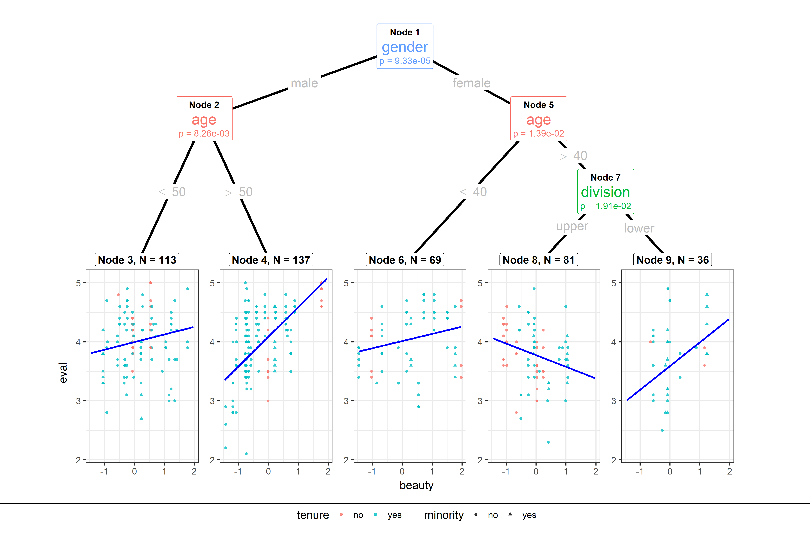

ggparty
================

**ggplot2** visualizations for the **partykit** package.

## Install

``` r
devtools::install_github("martin-borkovec/ggparty", 
                         dependencies = TRUE)
```

## Example

``` r
library(ggparty)

data("TeachingRatings", package = "AER")
tr <- subset(TeachingRatings, credits == "more")

tr_tree <- lmtree(eval ~ beauty | minority + age + gender + division + native +
                    tenure, data = tr, weights = students, caseweights = FALSE)

ggparty(tr_tree,
        terminal_space = 0.5,
        add_vars = list(p.value = "$node$info$p.value")) +
  geom_edge(size = 1.5) +
  geom_edge_label(colour = "grey", size = 6) +
  geom_node_plot(gglist = list(geom_point(aes(x = beauty,
                                             y = eval,
                                             col = tenure,
                                             shape = minority),
                                         alpha = 0.8),
                              theme_bw(base_size = 15)),
                scales = "fixed",
                id = "terminal",
                shared_axis_labels = T,
                shared_legend = T,
                legend_separator = T,
                predict = "beauty",
                predict_gpar = list(col = "blue",
                                   size = 1.2)
                ) +
  geom_node_label(aes(col = splitvar),
                  line_list = list(aes(label = paste("Node", id)),
                                   aes(label = splitvar),
                                   aes(label = paste("p =", formatC(p.value, format = "e", digits = 2)))),
                  line_gpar = list(list(size = 12, col = "black", fontface = "bold"),
                                   list(size = 20),
                                   list(size = 12)),
                  ids = "inner") +
  geom_node_label(aes(label = paste0("Node ", id, ", N = ", nodesize)),
                  fontface = "bold",
                  ids = "terminal",
                  size = 5, 
                  nudge_y = 0.01) +
  theme(legend.position = "none")
```

<!-- -->

## How to Use

**ggparty** tries to stick as closely as possible to **ggplot2**’s
grammar of graphics. The basic building blocks to a **ggparty** plot
are:

  - **ggparty()** replaces the usual `ggplot()`. Takes a object of class
    `'party'` instead of a `'data.frame'`.

  - **geom\_edge()** draws the edges between the nodes

  - **geom\_edge\_label()** labels the edges with the corresponding
    split breaks

  - **geom\_node\_label()** labels the nodes with the split variable,
    node info or anything else. The shorthand versions of this geom
    **geom\_node\_splitvar()** and **geom\_node\_info()** have the
    correct defaults to write the split variables in the inner nodes
    resp. the info in the terminal nodes.

  - **geom\_node\_plot()** creates a custom ggplot at the location of
    the node

Make sure to check out the vignettes for detailed information on the
usage of **ggparty**.

[](https://travis-ci.org/martin-borkovec/ggparty)
